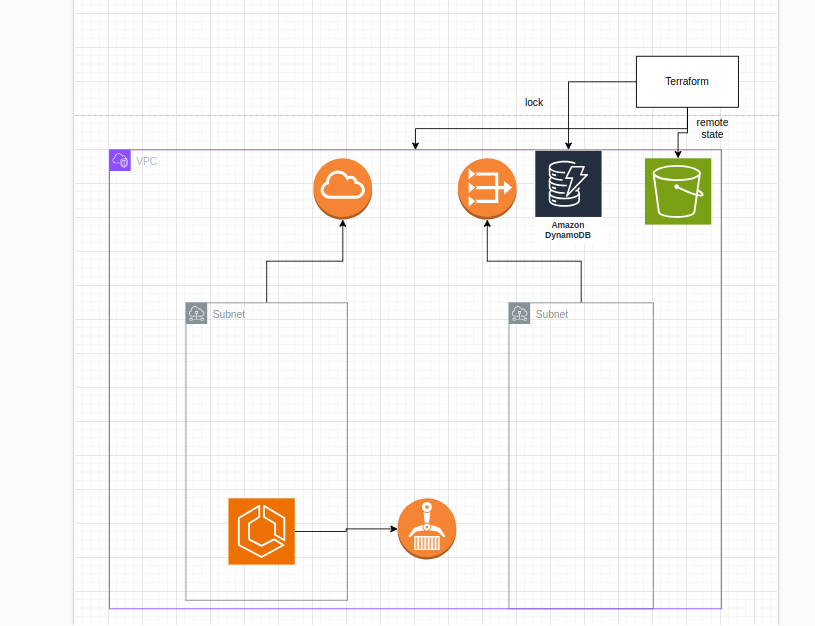

# Task Explation

Please use this ip to access the api
http://13.235.99.207:8000/list-bucket-content/

Note: i didnt have a domain thats why i havent implimented the https 

Here is an Arch Diagram for the Task

So i haved s3 as an remote backend and dynamodb table to create a lock

the VPC desgin is simple one private subnet one plublic subnet with one igw and an nat gateway

the security group is accepting the traffic only on port 8000 that is also my container and host port

ecr is created via and terraform and to push new images to it we can impliment ci/cd pipelines

